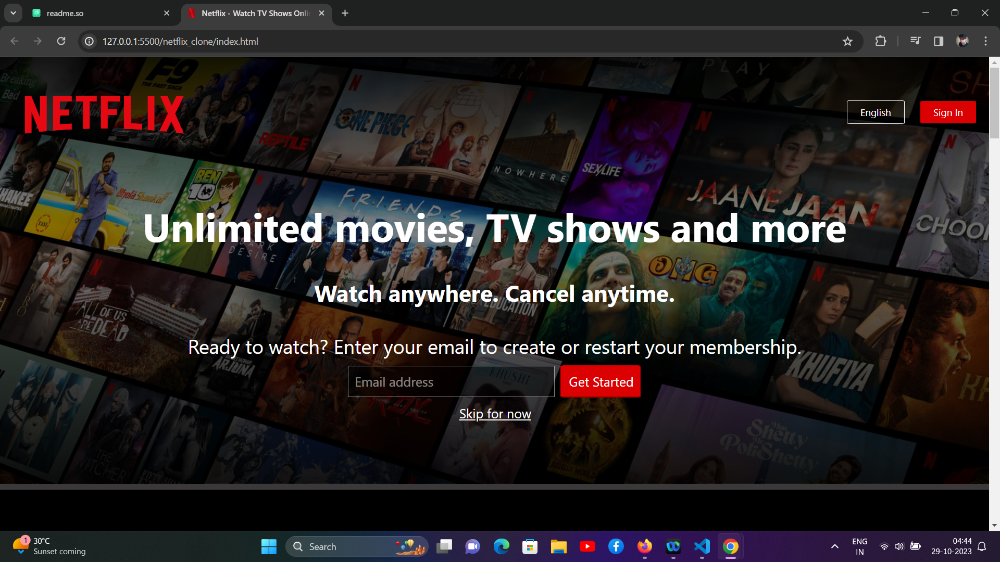
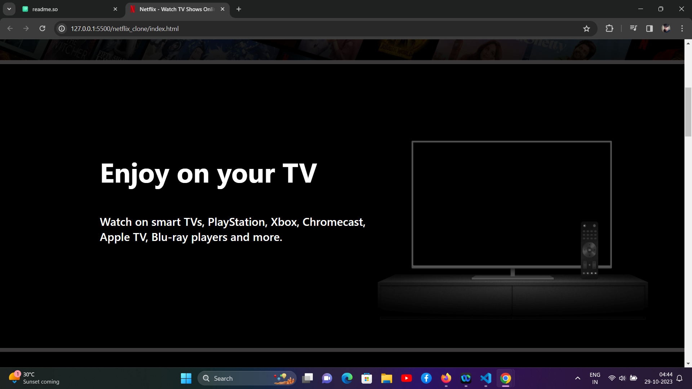
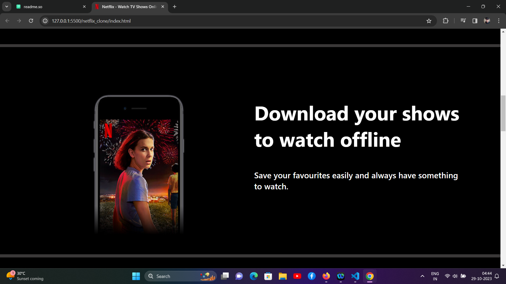
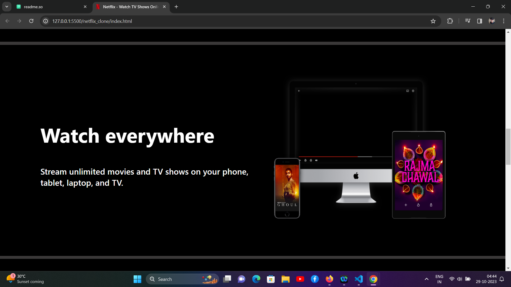
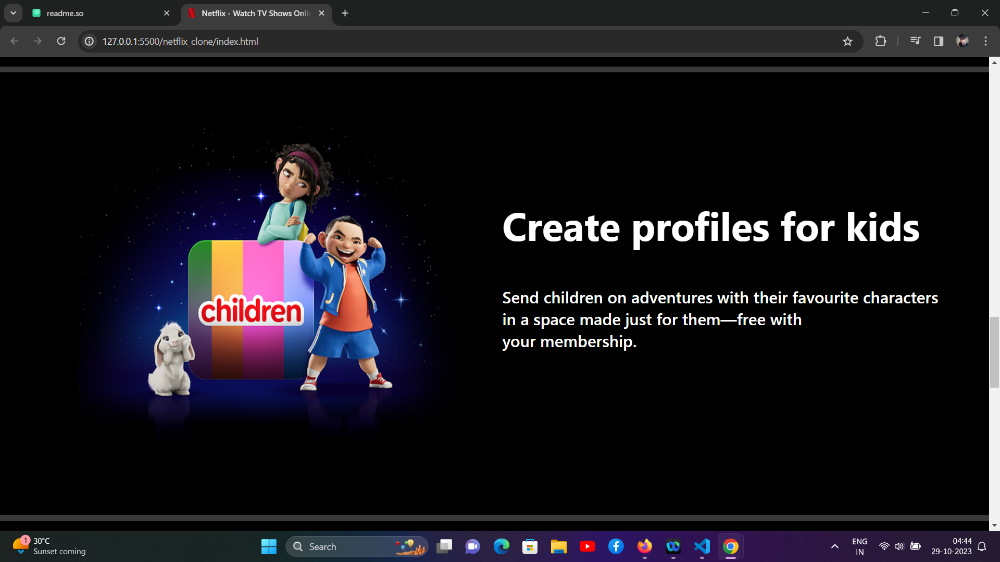
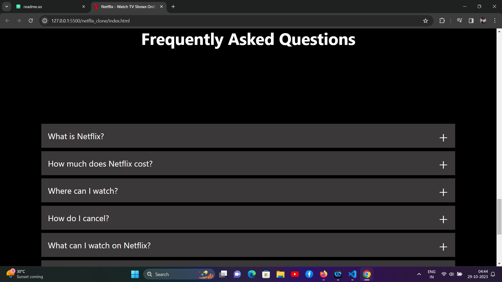
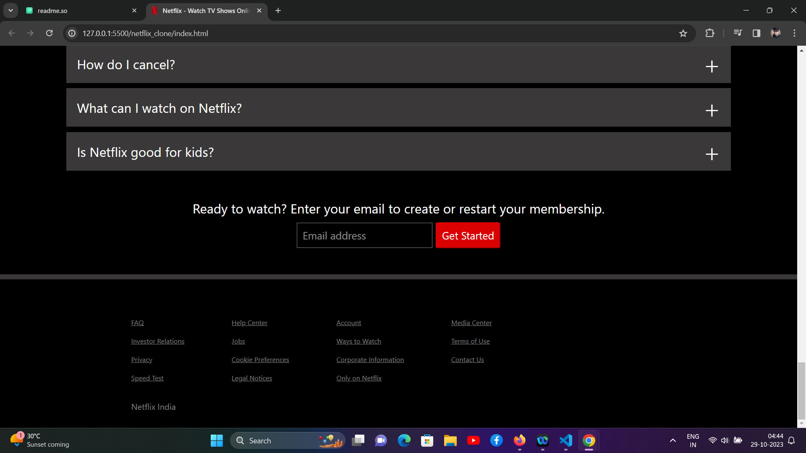

# Netflix Clone Project

Welcome to our Netflix Clone project, a collaborative effort by three members from [SGSITS](https://www.sgsits.ac.in/). This project aims to recreate the popular streaming service Netflix using HTML and CSS.

## Project Introduction

The Netflix Clone project is a web application designed to replicate the well-known Netflix user interface. As part of our college project, we've focused on honing our HTML and CSS skills while creating a visually appealing and responsive imitation of Netflix's front-end.
## Team Members

Meet the talented individuals behind this project:

- **Member 1:** [Abhinav Dave](https://github.com/Abhinavdave07)
- **Member 2:** [Bhagyadeep Mahawar](https://github.com/bhagyadeep13)
- **Member 3:** [Abhay Bamboriya](https://github.com/AbhayBamboriya)
## Installation

To run this project locally, follow these steps:

1. Clone the repository:
```bash
git clone https://github.com/your-username/netflix-clone.git
```

2. Navigate to the project folder:
```bash
cd netflix-clone
```
## Usage

1. Open the `index.html` file in your preferred web browser.

2. Explore the Netflix clone. You can click on movie titles to see more details.

3. Customize the content by modifying the HTML and CSS to add your own movies, images, and descriptions.

## Demo

To see a live demo of the Netflix clone project: [click here](http://127.0.0.1:5500/netflix_clone/index.html)

## Features

- Responsive design, making it suitable for different screen sizes.
- Display of movie titles, images, and descriptions.
- Navigation bar with Netflix logo and user profile icon.
- Custom CSS styling to resemble the Netflix user interface.
## Screenshots










## How to contribute

1. Take a look at the existing [issues](https://github.com/Abhinavdave07/netflix_clone/issues).
2. [Fork the Repo](https://github.com/Abhinavdave07/netflix_clone/fork), create a branch for any issue that you are working on and commit your work.
3. Create a [Pull Request](https://github.com/Abhinavdave07/netflix_clone/pulls) (PR), which will be promptly reviewed and given suggestions for improvements by the community.
4. Add screenshots or screen captures to your Pull Request to help us understand the effects of the changes that are included in your commits.


## How to create a pull request

1. Start by making a fork the Netflix-Clone repository. Click on the  symbol at the top right corner.

2. Clone your new fork of the repository:

```bash
git clone https://github.com/<your-github-username>/Netflix_Clone
```
3. Set upstream command:
```bash
git remote add upstreamhttps://github.com/Abhinavdave07/netflix_clone.git
```

4. Navigate to the new project directory:
```bash
cd Netflix_Clone
```
5. Create a new branch:
```bash
git checkout -b YourBranchName
```
6. Sync your fork or local repository with the origin repository:

* In your forked repository click on "Fetch upstream"
* Click "Fetch and merge".
## [Github Docs](https://docs.github.com/en/pull-requests/collaborating-with-pull-requests/addressing-merge-conflicts/resolving-a-merge-conflict-on-github) for Syncing
7. Make your changes to the source code.

8. Stage your changes and commit:
```bash
git add .
```
```bash
git commit -m "<your_commit_message>"
```
9. Push your local commits to the remote repository:
```bash
git push origin YourBranchName
```
10. Create a [Pull Request](https://github.com/Abhinavdave07/netflix_clone/pulls)!

11. Congratulations! You've made your first contribution! 


